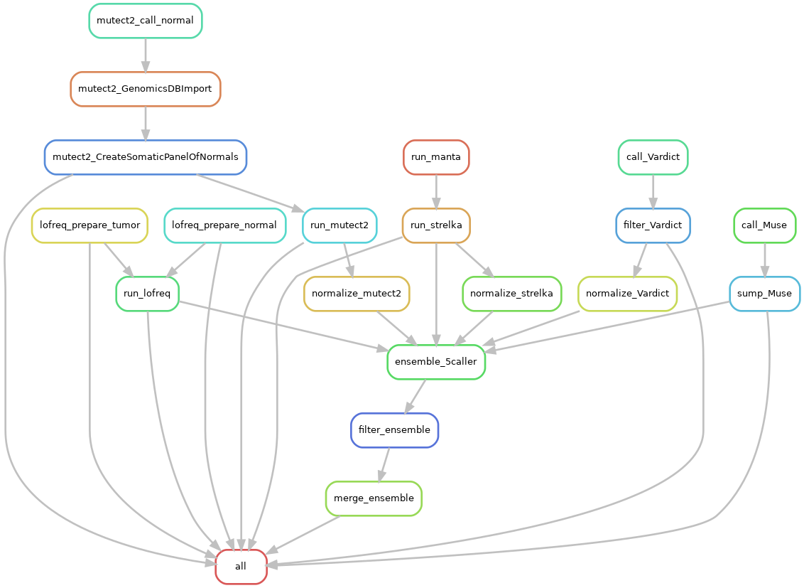

# somatic-conda

This workflow is a conda-based snakemake workflow, based on two previous developments:
+ [somaticseq2](https://github.com/NCI-CGR/somaticseq2)
  + Five callers: LoFreq, MuSE, MuTect2 (GATK4), Strelka and VarDict
+ [somaticCombiner](https://github.com/mingyi-wang/somatic-combiner)

There are several improvements compared to somaticseq2:
+ We use the feature [Containerization of Conda based workflows](https://snakemake.readthedocs.io/en/stable/snakefiles/deployment.html#containerization-of-conda-based-workflows) to make this Snakemake workflow more portable.
  +  However, it does not work at CCAD by default as the old sysmtem CentOS 6 is used. We built a special docker image docker://cgrlab/somatic_conda:1.0.6 to fix this issue. 
  +  Translated all the hard-coded bfx tools to the conda version and further consolidate into a docker container. 
+ Merge the pre-process steps to the main workflow. 
+ A separated resource bundle at Zenodo to facilitate deployment.
  + [](https://doi.org/10.5281/zenodo.7084057)



*The workflow diagram of somatic-conda*

---
## Dependencies
+ Snakemake (Version 7.2.0+)
  + There is a bug in Snakemake I reported at https://github.com/snakema
ke/snakemake/issues/1456.  It was fixed since the Snakemake release 7.2.0.
+ Singularity
  
[:boom:] Both Snakemake and Singularity are available as modules in Biowulf, so there is no need to install them for NIH/NCI users. 

---
## Get started

### Run somatic-conda at Biowulf
```bash

#### Create the working folder under your project space and change to that directory.


### Start an interactive session
sinteractive --time=2160


### Load snakemake
module load snakemake/7.3.7

snakemake --version
# 7.3.7

### Prepare the working space for the demo
#### 1. Clone somatic-conda under your working directory
git clone https://github.com/NCI-CGR/somatic-conda.git

cp somatic-conda/config/config.all_under_workspace.yaml config.yaml
cp somatic-conda/scripts/{run_somatic_conda_biowulf.sh,somatic_conda_wrapper_biowulf.sh} .

#### 2. Download hg19 resource bundle  
wget https://zenodo.org/record/7084057/files/somaticseq2_resource_bundle.zip

unzip somaticseq2_resource_bundle.zip

# remove the zip to save space (optional)
rm -f somaticseq2_resource_bundle.zip

#### 3. Run the pipeline
.  run_somatic_conda_biowulf.sh
```

You may monitor the job running in the slurm cluster using squeue, or following the log files under the folder *logs*


### Output files are available under the folder *output*
```bash
### The likely output 
tree -L 2 output
output
├── Ensemble
│   ├── CTRL_NA24385_tumor10PNA12878-1_vs_CTRL_NA24385_germline1_5callers_voting_PASS.vcf
│   ├── CTRL_NA24385_tumor10PNA12878-1_vs_CTRL_NA24385_germline1_5callers_voting_PASS.vcf.idx
│   ├── CTRL_NA24385_tumor10PNA12878-1_vs_CTRL_NA24385_germline1_5callers_voting.recode.vcf
│   ├── CTRL_NA24385_tumor10PNA12878-1_vs_CTRL_NA24385_germline1_5callers_voting.sort.vcf
│   ├── CTRL_NA24385_tumor10PNA12878-1_vs_CTRL_NA24385_germline1_5callers_voting.sort.vcf.idx
│   ├── CTRL_NA24385_tumor20PNA12878-2_vs_CTRL_NA24385_germline1_5callers_voting_PASS.vcf
│   ├── CTRL_NA24385_tumor20PNA12878-2_vs_CTRL_NA24385_germline1_5callers_voting_PASS.vcf.idx
│   ├── CTRL_NA24385_tumor20PNA12878-2_vs_CTRL_NA24385_germline1_5callers_voting.recode.vcf
│   ├── CTRL_NA24385_tumor20PNA12878-2_vs_CTRL_NA24385_germline1_5callers_voting.sort.vcf
│   ├── CTRL_NA24385_tumor20PNA12878-2_vs_CTRL_NA24385_germline1_5callers_voting.sort.vcf.idx
│   └── merge
├── Lofreq
│   ├── CTRL_NA24385_tumor10PNA12878-1_vs_CTRL_NA24385_germline1_normal_relaxed.log
│   ├── CTRL_NA24385_tumor10PNA12878-1_vs_CTRL_NA24385_germline1_normal_relaxed.vcf.gz
│   ├── CTRL_NA24385_tumor10PNA12878-1_vs_CTRL_NA24385_germline1_normal_relaxed.vcf.gz.tbi
│   ├── CTRL_NA24385_tumor10PNA12878-1_vs_CTRL_NA24385_germline1_normal_stringent.indels.vcf.gz
│   ├── CTRL_NA24385_tumor10PNA12878-1_vs_CTRL_NA24385_germline1_normal_stringent.indels.vcf.gz.tbi
│   ├── CTRL_NA24385_tumor10PNA12878-1_vs_CTRL_NA24385_germline1_normal_stringent.snvs.vcf.gz
│   ├── CTRL_NA24385_tumor10PNA12878-1_vs_CTRL_NA24385_germline1_normal_stringent.snvs.vcf.gz.tbi
│   ├── CTRL_NA24385_tumor10PNA12878-1_vs_CTRL_NA24385_germline1_somatic_final.indels.vcf.gz
│   ├── CTRL_NA24385_tumor10PNA12878-1_vs_CTRL_NA24385_germline1_somatic_final.indels.vcf.gz.tbi
│   ├── CTRL_NA24385_tumor10PNA12878-1_vs_CTRL_NA24385_germline1_somatic_final_minus-dbsnp.indels.vcf.gz
│   ├── CTRL_NA24385_tumor10PNA12878-1_vs_CTRL_NA24385_germline1_somatic_final_minus-dbsnp.indels.vcf.gz.tbi
│   ├── CTRL_NA24385_tumor10PNA12878-1_vs_CTRL_NA24385_germline1_somatic_final_minus-dbsnp.snvs.vcf.gz
│   ├── CTRL_NA24385_tumor10PNA12878-1_vs_CTRL_NA24385_germline1_somatic_final_minus-dbsnp.snvs.vcf.gz.tbi
│   ├── CTRL_NA24385_tumor10PNA12878-1_vs_CTRL_NA24385_germline1_somatic_final.snvs.vcf.gz
│   ├── CTRL_NA24385_tumor10PNA12878-1_vs_CTRL_NA24385_germline1_somatic_final.snvs.vcf.gz.tbi
│   ├── CTRL_NA24385_tumor10PNA12878-1_vs_CTRL_NA24385_germline1_somatic_raw.indels.vcf.gz
│   ├── CTRL_NA24385_tumor10PNA12878-1_vs_CTRL_NA24385_germline1_somatic_raw.indels.vcf.gz.tbi
│   ├── CTRL_NA24385_tumor10PNA12878-1_vs_CTRL_NA24385_germline1_somatic_raw.snvs.vcf.gz
│   ├── CTRL_NA24385_tumor10PNA12878-1_vs_CTRL_NA24385_germline1_somatic_raw.snvs.vcf.gz.tbi
│   ├── CTRL_NA24385_tumor10PNA12878-1_vs_CTRL_NA24385_germline1_tumor_relaxed.log
│   ├── CTRL_NA24385_tumor10PNA12878-1_vs_CTRL_NA24385_germline1_tumor_relaxed.vcf.gz
│   ├── CTRL_NA24385_tumor10PNA12878-1_vs_CTRL_NA24385_germline1_tumor_relaxed.vcf.gz.tbi
│   ├── CTRL_NA24385_tumor10PNA12878-1_vs_CTRL_NA24385_germline1_tumor_stringent.indels.vcf.gz
│   ├── CTRL_NA24385_tumor10PNA12878-1_vs_CTRL_NA24385_germline1_tumor_stringent.indels.vcf.gz.tbi
│   ├── CTRL_NA24385_tumor10PNA12878-1_vs_CTRL_NA24385_germline1_tumor_stringent.snvs.vcf.gz
│   ├── CTRL_NA24385_tumor10PNA12878-1_vs_CTRL_NA24385_germline1_tumor_stringent.snvs.vcf.gz.tbi
│   ├── CTRL_NA24385_tumor20PNA12878-2_vs_CTRL_NA24385_germline1_normal_relaxed.log
│   ├── CTRL_NA24385_tumor20PNA12878-2_vs_CTRL_NA24385_germline1_normal_relaxed.vcf.gz
│   ├── CTRL_NA24385_tumor20PNA12878-2_vs_CTRL_NA24385_germline1_normal_relaxed.vcf.gz.tbi
│   ├── CTRL_NA24385_tumor20PNA12878-2_vs_CTRL_NA24385_germline1_normal_stringent.indels.vcf.gz
│   ├── CTRL_NA24385_tumor20PNA12878-2_vs_CTRL_NA24385_germline1_normal_stringent.indels.vcf.gz.tbi
│   ├── CTRL_NA24385_tumor20PNA12878-2_vs_CTRL_NA24385_germline1_normal_stringent.snvs.vcf.gz
│   ├── CTRL_NA24385_tumor20PNA12878-2_vs_CTRL_NA24385_germline1_normal_stringent.snvs.vcf.gz.tbi
│   ├── CTRL_NA24385_tumor20PNA12878-2_vs_CTRL_NA24385_germline1_somatic_final.indels.vcf.gz
│   ├── CTRL_NA24385_tumor20PNA12878-2_vs_CTRL_NA24385_germline1_somatic_final.indels.vcf.gz.tbi
│   ├── CTRL_NA24385_tumor20PNA12878-2_vs_CTRL_NA24385_germline1_somatic_final_minus-dbsnp.indels.vcf.gz
│   ├── CTRL_NA24385_tumor20PNA12878-2_vs_CTRL_NA24385_germline1_somatic_final_minus-dbsnp.indels.vcf.gz.tbi
│   ├── CTRL_NA24385_tumor20PNA12878-2_vs_CTRL_NA24385_germline1_somatic_final_minus-dbsnp.snvs.vcf.gz
│   ├── CTRL_NA24385_tumor20PNA12878-2_vs_CTRL_NA24385_germline1_somatic_final_minus-dbsnp.snvs.vcf.gz.tbi
│   ├── CTRL_NA24385_tumor20PNA12878-2_vs_CTRL_NA24385_germline1_somatic_final.snvs.vcf.gz
│   ├── CTRL_NA24385_tumor20PNA12878-2_vs_CTRL_NA24385_germline1_somatic_final.snvs.vcf.gz.tbi
│   ├── CTRL_NA24385_tumor20PNA12878-2_vs_CTRL_NA24385_germline1_somatic_raw.indels.vcf.gz
│   ├── CTRL_NA24385_tumor20PNA12878-2_vs_CTRL_NA24385_germline1_somatic_raw.indels.vcf.gz.tbi
│   ├── CTRL_NA24385_tumor20PNA12878-2_vs_CTRL_NA24385_germline1_somatic_raw.snvs.vcf.gz
│   ├── CTRL_NA24385_tumor20PNA12878-2_vs_CTRL_NA24385_germline1_somatic_raw.snvs.vcf.gz.tbi
│   ├── CTRL_NA24385_tumor20PNA12878-2_vs_CTRL_NA24385_germline1_tumor_relaxed.log
│   ├── CTRL_NA24385_tumor20PNA12878-2_vs_CTRL_NA24385_germline1_tumor_relaxed.vcf.gz
│   ├── CTRL_NA24385_tumor20PNA12878-2_vs_CTRL_NA24385_germline1_tumor_relaxed.vcf.gz.tbi
│   ├── CTRL_NA24385_tumor20PNA12878-2_vs_CTRL_NA24385_germline1_tumor_stringent.indels.vcf.gz
│   ├── CTRL_NA24385_tumor20PNA12878-2_vs_CTRL_NA24385_germline1_tumor_stringent.indels.vcf.gz.tbi
│   ├── CTRL_NA24385_tumor20PNA12878-2_vs_CTRL_NA24385_germline1_tumor_stringent.snvs.vcf.gz
│   ├── CTRL_NA24385_tumor20PNA12878-2_vs_CTRL_NA24385_germline1_tumor_stringent.snvs.vcf.gz.tbi
│   ├── normalBAM
│   └── tumorBAM
├── Manta
│   ├── CTRL_NA24385_tumor10PNA12878-1_vs_CTRL_NA24385_germline1
│   └── CTRL_NA24385_tumor20PNA12878-2_vs_CTRL_NA24385_germline1
├── Muse
│   ├── CTRL_NA24385_tumor10PNA12878-1_vs_CTRL_NA24385_germline1_passed.vcf
│   ├── CTRL_NA24385_tumor10PNA12878-1_vs_CTRL_NA24385_germline1.vcf
│   ├── CTRL_NA24385_tumor20PNA12878-2_vs_CTRL_NA24385_germline1_passed.vcf
│   ├── CTRL_NA24385_tumor20PNA12878-2_vs_CTRL_NA24385_germline1.vcf
│   ├── merged_CTRL_NA24385_tumor10PNA12878-1_vs_CTRL_NA24385_germline1_all.txt
│   └── merged_CTRL_NA24385_tumor20PNA12878-2_vs_CTRL_NA24385_germline1_all.txt
├── Mutect2
│   ├── CTRL_NA24385_tumor10PNA12878-1_vs_CTRL_NA24385_germline1_WES_passed.vcf
│   ├── CTRL_NA24385_tumor10PNA12878-1_vs_CTRL_NA24385_germline1_WES_passed.vcf.filteringStats.tsv
│   ├── CTRL_NA24385_tumor10PNA12878-1_vs_CTRL_NA24385_germline1_WES_passed.vcf.idx
│   ├── CTRL_NA24385_tumor10PNA12878-1_vs_CTRL_NA24385_germline1_WES_passed_vt_sorted.vcf.gz
│   ├── CTRL_NA24385_tumor10PNA12878-1_vs_CTRL_NA24385_germline1_WES_passed_vt_sorted.vcf.gz.tbi
│   ├── CTRL_NA24385_tumor10PNA12878-1_vs_CTRL_NA24385_germline1_WES_passed_vt.vcf
│   ├── CTRL_NA24385_tumor10PNA12878-1_vs_CTRL_NA24385_germline1_WES.vcf
│   ├── CTRL_NA24385_tumor10PNA12878-1_vs_CTRL_NA24385_germline1_WES.vcf.idx
│   ├── CTRL_NA24385_tumor10PNA12878-1_vs_CTRL_NA24385_germline1_WES.vcf.stats
│   ├── CTRL_NA24385_tumor20PNA12878-2_vs_CTRL_NA24385_germline1_WES_passed.vcf
│   ├── CTRL_NA24385_tumor20PNA12878-2_vs_CTRL_NA24385_germline1_WES_passed.vcf.filteringStats.tsv
│   ├── CTRL_NA24385_tumor20PNA12878-2_vs_CTRL_NA24385_germline1_WES_passed.vcf.idx
│   ├── CTRL_NA24385_tumor20PNA12878-2_vs_CTRL_NA24385_germline1_WES_passed_vt_sorted.vcf.gz
│   ├── CTRL_NA24385_tumor20PNA12878-2_vs_CTRL_NA24385_germline1_WES_passed_vt_sorted.vcf.gz.tbi
│   ├── CTRL_NA24385_tumor20PNA12878-2_vs_CTRL_NA24385_germline1_WES_passed_vt.vcf
│   ├── CTRL_NA24385_tumor20PNA12878-2_vs_CTRL_NA24385_germline1_WES.vcf
│   ├── CTRL_NA24385_tumor20PNA12878-2_vs_CTRL_NA24385_germline1_WES.vcf.idx
│   ├── CTRL_NA24385_tumor20PNA12878-2_vs_CTRL_NA24385_germline1_WES.vcf.stats
│   └── PON
├── Strelka
│   ├── CTRL_NA24385_tumor10PNA12878-1_vs_CTRL_NA24385_germline1
│   └── CTRL_NA24385_tumor20PNA12878-2_vs_CTRL_NA24385_germline1
└── Vardict
    ├── CTRL_NA24385_tumor10PNA12878-1_vs_CTRL_NA24385_germline1_all_fil.vcf
    ├── CTRL_NA24385_tumor10PNA12878-1_vs_CTRL_NA24385_germline1_all_fil.vcf.idx
    ├── CTRL_NA24385_tumor10PNA12878-1_vs_CTRL_NA24385_germline1_all_sorted.vcf
    ├── CTRL_NA24385_tumor10PNA12878-1_vs_CTRL_NA24385_germline1_all_sorted.vcf.idx
    ├── CTRL_NA24385_tumor10PNA12878-1_vs_CTRL_NA24385_germline1_all.vcf
    ├── CTRL_NA24385_tumor10PNA12878-1_vs_CTRL_NA24385_germline1_final.vcf
    ├── CTRL_NA24385_tumor10PNA12878-1_vs_CTRL_NA24385_germline1_final.vcf.idx
    ├── CTRL_NA24385_tumor10PNA12878-1_vs_CTRL_NA24385_germline1_final_vt_sorted.vcf.gz
    ├── CTRL_NA24385_tumor10PNA12878-1_vs_CTRL_NA24385_germline1_final_vt_sorted.vcf.gz.tbi
    ├── CTRL_NA24385_tumor10PNA12878-1_vs_CTRL_NA24385_germline1_final_vt.vcf
    ├── CTRL_NA24385_tumor20PNA12878-2_vs_CTRL_NA24385_germline1_all_fil.vcf
    ├── CTRL_NA24385_tumor20PNA12878-2_vs_CTRL_NA24385_germline1_all_fil.vcf.idx
    ├── CTRL_NA24385_tumor20PNA12878-2_vs_CTRL_NA24385_germline1_all_sorted.vcf
    ├── CTRL_NA24385_tumor20PNA12878-2_vs_CTRL_NA24385_germline1_all_sorted.vcf.idx
    ├── CTRL_NA24385_tumor20PNA12878-2_vs_CTRL_NA24385_germline1_all.vcf
    ├── CTRL_NA24385_tumor20PNA12878-2_vs_CTRL_NA24385_germline1_final.vcf
    ├── CTRL_NA24385_tumor20PNA12878-2_vs_CTRL_NA24385_germline1_final.vcf.idx
    ├── CTRL_NA24385_tumor20PNA12878-2_vs_CTRL_NA24385_germline1_final_vt_sorted.vcf.gz
    ├── CTRL_NA24385_tumor20PNA12878-2_vs_CTRL_NA24385_germline1_final_vt_sorted.vcf.gz.tbi
    └── CTRL_NA24385_tumor20PNA12878-2_vs_CTRL_NA24385_germline1_final_vt.vcf

15 directories, 106 files
```

+ The expected essential output files are also available under somatic-conda/tests/expected_output/output for your reference.
```
tree  somatic-conda/tests/expected_output/output
somatic-conda/tests/expected_output/output
├── Ensemble
│   └── merge
│       └── merged.vcf
├── Lofreq
│   ├── CTRL_NA24385_tumor10PNA12878-1_vs_CTRL_NA24385_germline1_somatic_final.indels.vcf.gz.tbi
│   ├── CTRL_NA24385_tumor10PNA12878-1_vs_CTRL_NA24385_germline1_somatic_final.snvs.vcf.gz.tbi
│   ├── CTRL_NA24385_tumor20PNA12878-2_vs_CTRL_NA24385_germline1_somatic_final.indels.vcf.gz.tbi
│   └── CTRL_NA24385_tumor20PNA12878-2_vs_CTRL_NA24385_germline1_somatic_final.snvs.vcf.gz.tbi
├── Muse
│   ├── CTRL_NA24385_tumor10PNA12878-1_vs_CTRL_NA24385_germline1_passed.vcf
│   └── CTRL_NA24385_tumor20PNA12878-2_vs_CTRL_NA24385_germline1_passed.vcf
├── Mutect2
│   ├── CTRL_NA24385_tumor10PNA12878-1_vs_CTRL_NA24385_germline1_WES_passed.vcf
│   └── CTRL_NA24385_tumor20PNA12878-2_vs_CTRL_NA24385_germline1_WES_passed.vcf
├── Strelka
│   ├── CTRL_NA24385_tumor10PNA12878-1_vs_CTRL_NA24385_germline1
│   │   └── results
│   │       └── variants
│   │           ├── somatic.indels.vcf.gz
│   │           └── somatic.snvs.vcf.gz
│   └── CTRL_NA24385_tumor20PNA12878-2_vs_CTRL_NA24385_germline1
│       └── results
│           └── variants
│               ├── somatic.indels.vcf.gz
│               └── somatic.snvs.vcf.gz
└── Vardict
    ├── CTRL_NA24385_tumor10PNA12878-1_vs_CTRL_NA24385_germline1_final.vcf
    └── CTRL_NA24385_tumor20PNA12878-2_vs_CTRL_NA24385_germline1_final.vcf

13 directories, 15 files
```

---

## Some details about the docker image used in workflow/Snakefile.conda_docker 
+ [Default dockerfile generated by snakemake](./dockerfiles/somatic_conda_auto.dockerfile)
  + The dockerfile was generated by Snakemake as demonstrated [here](https://snakemake.readthedocs.io/en/stable/snakefiles/deployment.html#containerization-of-conda-based-workflows).  However, the default base image: *condaforge/mambaforge:latest* cannot work at CCAD with CentOS 6.
+ [Dockerfile](./dockerfiles/containerize_base.dockerfile) of the new base image to work at CCAD: *cgrlab/mamba_centos6:1.0.0*.
  + Use *conda/miniconda3-centos6* instead.
  + Additionally, install *mamba* to speed up the installation of the conda packages.
+ [Modified dockerfile](./dockerfiles/somatic_conda_ws5.dockerfile) for *cgrlab/somatic_conda:1.0.6* used in workflow/Snakefile.conda_docker, based on the default one.
  

---

## TODO
+ Many old settings from the original pipelines remaining in config.yaml need to be cleaned.
+ Instructions to run under CCAD will be provided upon request.
+ The whole workflow has not been fully tested yet.   